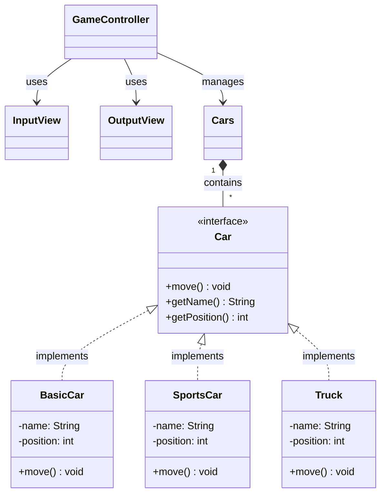

# 🏎️ Racing Car - 객체지향 자동차 경주 게임
<br>


> **Racing Car**는 Java를 활용하여 다형성(Polymorphism)과 MVC 디자인 패턴을 적용한 콘솔 기반 자동차 경주 게임입니다. 
> 도메인 로직과 UI 로직을 완벽히 분리하고, 역할(인터페이스)과 구현(클래스)을 나누어 유연하고 확장 가능한 아키텍처를 설계하는 데 집중했습니다.

<br/>

## 👨‍💻 Team & Contribution
객체지향 설계 원칙을 준수하기 위해 뼈대 구축과 비즈니스 로직 구현으로 역할을 분담하여 협업을 진행했습니다
<table>
  <tbody>
    <tr>
      <td align="center"><a href="https://github.com/chan-nni"><br /><sub><b>강찬미</b></sub></a><br /></td>
      <td align="center"><a href="https://github.com/chl31031"><br /><sub><b>조한림</b></sub></a><br /></td>
    </tr>
  </tbody>
</table>

* **강찬미 (아키텍처 & 도메인 설계):** MVC 패키지 구조 세팅, Car 인터페이스 기반 다형성 설계, Cars 일급 컬렉션 도입 및 캡슐화 설계
* **조한림 (비즈니스 로직 & 뷰):** Stream API를 활용한 우승자 추출 로직 구현, 입력 문자열 파싱 및 팩토리 로직 처리, String.repeat()을 활용한 직관적인 UI 출력 구현

<br/>

## 🛠️ Tech Stack
* **Language:** Java 21
* **Architecture:** MVC Pattern, Object-Oriented Programming (OOP)
* **Build Tool:** Gradle

<br/>

## 📋 핵심 기능 및 도메인 명세 (Core Features & Domain)

### 🚗 1. 자동차 규약 및 차종 (Car & Concrete Classes)
* **핵심 기능:** 차종별 고유의 이동 정책에 따라 전진 여부와 이동 거리 결정
> **💡 주요 특징 및 구조**
> - **BasicCar:** 무작위 값 4 이상일 때 1칸 전진
> - **SportsCar:** 무작위 값 4 이상일 때 2칸 전진 (이동폭 큼)
> - **Truck:** 무작위 값 5 이상일 때 1칸 전진 (전진 확률 낮음)

### 📦 2. 레이싱 통제 (Cars - 일급 컬렉션)
* **핵심 기능:** 경주에 참여하는 모든 자동차 객체들의 상태를 일괄 관리하고 우승자를 판별
> **💡 주요 특징 및 구조**
> - `List<Car>`를 포장(wrapping)하여 컬렉션의 불변성을 보장하고 도메인 로직의 응집도를 높임.

### 🎮 3. 게임 흐름 제어 (GameController)
* **핵심 기능:** 사용자 입력을 받아 객체를 생성하고, 지정된 라운드만큼 경주를 진행한 후 최종 결과를 발표
> **💡 주요 특징 및 구조**
> - 구체적인 차종을 몰라도 `Car` 인터페이스의 `move()`만을 호출하여 OCP(개방-폐쇄 원칙) 준수

<br/>

## 💡 Core Architecture & Key Logic (핵심 설계)

유지보수와 기능 확장을 고려하여 구조의 깊이를 더하는 세 가지 핵심 개념을 적용했습니다.

### 1. 다형성(Polymorphism)을 활용한 역할과 구현의 분리 (by 강찬미)
* **내용:** `Car`라는 공통 인터페이스를 정의하고, 각 차종이 이를 구현(`implements`)하도록 설계했습니다.
* **효과:** `GameController`는 새로운 차종(예: `Bus`, `Bicycle`)이 추가되어도 기존 코드를 전혀 수정할 필요 없이 동일하게 제어할 수 있습니다.
* **핵심 로직:**
    ```java
    public interface Car {
        void move();
        String getName();
        int getPosition();
    }
    ```

### 2. 일급 컬렉션(First-Class Collection) 적용 (by 강찬미)
* **내용:** `List<Car>`를 직접 다루지 않고 `Cars`라는 클래스로 감싸서, 자동차 묶음과 관련된 비즈니스 로직을 한 곳으로 모았습니다.
* **효과:** 데이터를 조작하는 로직(전체 이동, 우승자 추출)이 컨트롤러에 흩어지지 않고, 도메인 객체 스스로가 책임을 가지게 됩니다.
* **핵심 로직:**
    ```java
    public class Cars {
        private final List<Car> carList;

        public Cars(List<Car> carList) {
            this.carList = carList;
        }

        public void moveAll() {
            carList.forEach(Car::move); // 컨트롤러 대신 여기서 일괄 처리
        }
        
        // 우승자 판별 로직 캡슐화
        public List<String> getWinners() { ... } 
    }
    ```

### 3. 객체 생성 로직 분리 및 Stream API 적용 (by 조한림)

* **내용:** 사용자 입력 파싱 및 다형성 객체 생성 로직을 `parseCars()` 메서드로 추출하고, 우승자 판별 로직에 Java Stream API를 적용했습니다.
* **효과:** 객체 생성 책임을 분리하여 컨트롤러의 응집도를 높이고, 반복문이나 가변 상태 조작 없이 선언적인 데이터 처리 파이프라인을 구축하여 코드의 가독성과 안정성을 확보했습니다.
* **핵심 로직:**
```java
// 1. 객체 생성 및 부모 타입(Car) 업캐스팅 반환
private List<Car> parseCars(String input) { ... }

// 2. Stream 파이프라인을 활용한 우승자 추출 (Cars 내부)
public List<String> getWinners() {
    int maxPosition = carList.stream()
            .mapToInt(Car::getPosition)
            .max()
            .orElse(0);

    return carList.stream()
            .filter(car -> car.getPosition() == maxPosition)
            .map(Car::getName)
            .collect(Collectors.toList());
}

```

<br/>

## 🗺️ Class Diagram (UML)
도메인 객체 간의 관계와 다형성 구조를 나타냅니다.



## 📂 Folder Structure

MVC 패턴과 관심사 분리 원칙에 따라 패키지를 구성했습니다.

```text
src/main/java/com/fullaccel/
├── Application.java           # 프로그램 실행 진입점 (Main)
├── controller/
│   └── GameController.java    # 도메인과 뷰를 연결하고 전체 흐름 제어
├── domain/
│   ├── Car.java               # 자동차 핵심 역할 규약 (Interface)
│   ├── BasicCar.java          # 기본 자동차 정책
│   ├── SportsCar.java         # 스포츠카 정책
│   ├── Truck.java             # 트럭 정책
│   └── Cars.java              # 일급 컬렉션 (자동차 리스트 래퍼)
├── util/
│   └── RandomUtils.java       # 전진 조건을 위한 난수 생성기
└── view/
    ├── InputView.java         # 사용자 입력 프롬프트 및 처리
    └── OutputView.java        # 라운드 진행 상황 및 우승자 출력

```

## 🔥 Troubleshooting (트러블슈팅)

### 1. 다형성 구조 설계 시 인터페이스의 추상화 범위 정의

* **문제:** Car 인터페이스 설계 시, 차종별로 다른 '이동 방식'과 공통 기능(이름/위치 조회)을 어떻게 분리하고 어디까지 추상화할지 역할의 모호함이 있었습니다.

* **해결:** 컨트롤러가 개별 차종에 의존하지 않도록, 모든 차량의 핵심 필수 행동(move, getName, getPosition)만을 인터페이스에 정의했습니다. 이를 통해 실제 이동 로직은 각 구현체 스스로 책임지게 만들었고, 새로운 차종이 추가되어도 메인 흐름은 변경되지 않는 유연하고 확장 가능한 뼈대를 완성했습니다.

## 🚀 Getting Started

```bash
# 1. 저장소 클론
git clone [https://github.com/full-accel/racingcar.git](https://github.com/full-accel/racingcar.git)

# 2. 디렉토리 이동
cd racingcar

# 3. 프로젝트 빌드 및 실행
# src/main/java/com/fullaccel/Application.java 파일의 main 메서드를 실행하세요.
